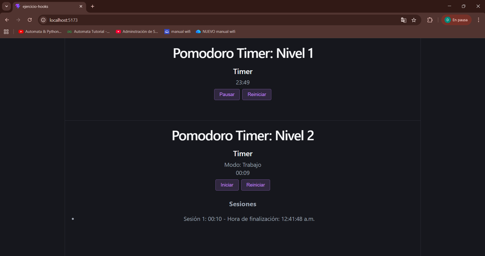

<h1 align="center">Ejercicio: Sistemas y Tecnologías Web</h1>
<h2 align="center">React Hooks: useState y useEffect</h2>

<h3>Descripción General</h3>

    El objetivo de este ejercicio es hacer uso de React Hooks para desarrollar una página web que muestre temporizadores Pomodoro.
    Para esto, se aplicará manejo de estado y efectos secundarios en React, principalmente <code>useState</code> y <code>useEffect</code>.

<h3>Instrucciones para correr el programa</h3>

Antes de poder correr el programa, es necesario instalar las dependencias. En la terminal, correr el siguiente comando:

~~~
npm install express
~~~

Ahora que ya están instaladas las dependencias, se utiliza el siguiente comando para correr el programa:

~~~
npm run dev
~~~

<h3>Screenshot del funcionamiento</h3>
